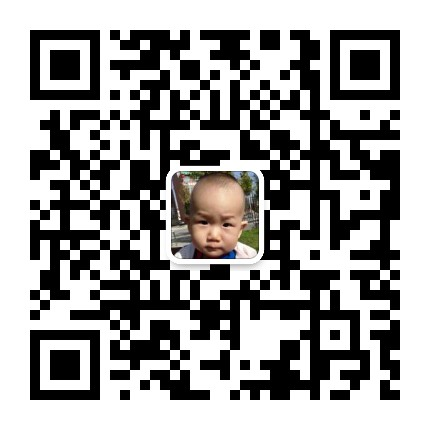

# UAVCAN_v0_Specification

UAVCAN v0 Specification (Chinese and English)

2020-02-12 

苦爷 wei.liu@cecooleye.cn

UAVCAN 也是 COOLFLY 项目中 AR8020 最后一个未打通的接口。完成支持后 COOLFLY 也就可以正式的发布了。

后续我们也会发布一些 UAVCAN 接口的 ESC 设备，为了便于更多的人一起测试，我趁瘟疫在家的几天，把相关文档整理翻译出来。

UAVCAN 是个比较有意思的协议，本仓库翻译的是 v0 版本的规范。现在这个协议已经被计划升级到所谓的 v1，物理层也不再局限于 CAN 总线，甚至连 UAVCAN 这个名称都做了一个更有趣的解释。

我对翻译也没什么经验，文中的一些还有不完善的地方，比如：Raft，allocatee/allocator，leader/Follower 等，还没有合适的翻译对照，我也正在请教周围的朋友。如有好的建议，或者更规范的翻译方法，可以邮件我，或者提交一个 issue。

## 版权声明

仓库中UAVCAN v0 Specification的文字和图片内容全部来源于 

https://uavcan.org/

## 目录

1. Introduction.md
2. Basic concepts.md
3. Data structure description language.md
4. CAN bus transport layer.md
5. Application-level conventions.md
6. Application-level functions.md
7. List of standard data types.md
8. Hardware design recommendations.md

## 修改记录
- 2020-02-12 首次更新。