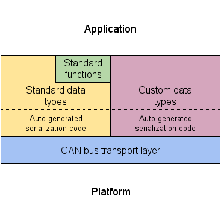

## UAVCAN Specification 2.Basic concepts

## Contents
- Basic concepts
	- Message broadcasting
		- Anonymous message broadcasting
    - Service invocation

## Basic concepts（ 基本概念）

UAVCAN is a lightweight protocol designed to provide a highly reliable communication method for aerospace and robotic applications via the CAN bus. The UAVCAN network is a decentralized peer network, where each peer (node) has a unique numeric identifier - node ID. The nodes of the UAVCAN network can communicate using any of the following communication methods:
UAVCAN 是一种轻量级协议，旨在通过 CAN 总线为航空航天和机器人应用提供一种高度可靠的通信方法。UAVCAN 网络是一个分布式对等网络，每个对等点(节点)都有一个唯一的数字标识符——节点 ID。UAVCAN 网络的节点可以使用以下任何一种通信方法进行通信:

 - Message broadcasting - The primary method of data exchange with publish/subscribe semantics.
 - 消息广播 —— 主要的进行数据交换的方式，通过使用发布/订阅语义进行。
 
 - Service invocation - The communication method for peer-to-peer request/response interactions.
 - 服务调用 —— 对等的请求/响应交互的通信方法。

For each type of communication, a predefined set of data structures is used, where each data structure has a unique identifier - the data type ID (DTID). Some data structures are standard and defined by the protocol specification; others may be specific to a particular application or vendor.
对于每种通信类型，都使用一组预定义的数据结构，其中每个数据结构都有一个惟一的标识符——数据类型 ID (DTID)。其中一部分数据结构是标准的，由协议规范定义；其他的则针对特定的应用程序或供应商。

Since every published message type has its own unique data type ID, and each node of the network has its own unique node ID, a pair of data type ID and node ID can be used to support redundant nodes with identical functionality inside the same network.
由于每个发布的消息类型都有自己惟一的数据类型 ID，而网络的每个节点都有自己惟一的节点 ID，因此可以使用一对数据类型 ID 和节点 ID 来支持具有相同功能的冗余节点。

Message and service data structures are defined using the data structure description language (DSDL). The DSDL description is used to generate the serialization/deserialization code for a given data structure in each target programming language. The DSDL approach allows compilers to determine the data structure size statically, thus helping to optimize the protocol implementations in terms of memory consumption and performance. This feature is important for deeply embedded systems, where the memory footprint is critical and dynamic memory allocation may not be acceptable.
消息和服务数据结构是使用数据结构描述语言(DSDL)定义的。DSDL描述用于在每种目标编程语言中为给定的数据结构生成序列化/反序列化代码。DSDL方法允许编译器静态地确定数据结构的大小，从而在内存消耗和性能方面帮助优化协议实现。这个特性对于深度嵌入式系统非常重要，因为内存占用非常重要，动态内存分配可能无法接受。

On top of the standard data types, UAVCAN defines a set of standard high-level functions including: node health monitoring, network discovery, time synchronization, firmware update, and more. For more information see the part of the specification dedicated to the standard data types and application level functions.
在标准数据类型之上，UAVCAN 定义了一组标准的高级功能，包括：节点健康监测、网络发现、时间同步、固件更新等。有关更多信息，请参见规范中专门介绍标准数据类型和应用程序级功能的部分。

Serialized message and service data structures are exchanged by means of the CAN bus transport layer, which implements automatic decomposition of long transfers into several CAN frames, allowing nodes to exchange data structures of arbitrary size.
序列化的消息和服务数据结构通过 CAN 总线传输层进行交换，该传输层实现将长传输自动分解为几个 CAN 帧，允许节点交换任意大小的数据结构。

### Message broadcasting （消息广播）

Message broadcasting refers to the transmission of a serialized data structure over the CAN bus to other nodes. This is the primary UAVCAN data exchange mechanism. Typical use cases may include transfer of the following kinds of data (either cyclically or on an adhoc basis): sensor measurements, actuator commands, or equipment status information.
消息广播是指通过CAN总线将序列化的数据结构传输到其他节点。这是主要的 UAVCAN 数据交换机制。典型的用例可能包括以下类型数据的传输（循环的或临时的）：传感器测量、执行器命令或设备状态信息。

A broadcast message includes the following information:
广播消息包括以下信息：

| Field（字段） | Content（内容） |	
| :-----| :------ |
| Payload | The serialized data structure |
| 有效载荷 | 序列化的数据结构 |
|Data type ID  | Numerical identifier that indicates how the data structure should be interpreted|
|数据类型 ID|指示如何解析数据结构的数字标识符|
| Source node ID | The node ID of the transmitting node |
| 源节点 ID | 发送节点的节点 ID  |
| Transfer ID | A small overflowing integer that increments with every transfer of this type of message from a given node |
| 传输 ID | 一个小的溢出整数，它随着从给定节点每次传输这种类型的消息而递增 |

#### Anonymous message broadcasting (匿名消息广播)
Nodes that don’t have a unique node ID can publish anonymous messages. An anonymous message is different from a regular message in that it doesn’t contain source node ID. This kind of data exchange is useful during initial configuration of the node, particularly during dynamic node ID allocation procedure.
没有节点ID的节点可以发布匿名消息。匿名消息与普通消息的不同之处在于它不包含源节点ID。这种数据交换在节点的初始配置过程中非常有用，特别是在动态节点ID分配过程中。

### Service invocation (服务调用)
Service invocation is a two-step data exchange between exactly two nodes: a client and a server. The steps are:
服务调是由两个步骤构成的在两个节点(客户机和服务器)之间使用的数据交换。步骤是：

 - 1.The client sends a service request to the server.
 - 1.客户端向服务器发送一个服务请求。
  
 - 2.The server takes appropriate actions and sends a response to the client.
 - 2.服务器采取适当的操作并向客户端发送响应。
 
Typical use cases for this type of communication include: node configuration parameter update, firmware update, adhoc action request, file transfer, and other service tasks.
这种通信类型的典型用例包括：节点配置参数更新、固件更新、特别操作请求、文件传输和其他服务任务。

Both service requests and service responses include the following data:
服务请求和服务响应都包括以下数据：

| Field（字段） | Content（内容） |	
| :-----| :------ |
| Payload | The serialized data structure |
| 有效载荷 | 序列化的数据结构 |
| Data type ID | Numerical identifier that indicates how the data structure should be interpreted |
|数据类型 ID|指示如何解析数据结构的数字标识符|
| Client node ID |	Source node ID during request transfer, destination node ID during response transfer|
| 客户端节点 ID | 请求传输阶段是源节点ID，响应传输阶段是目标节点 ID|
| Server node ID | Destination node ID during request transfer, source node ID during response transfer|
| 服务器节点 ID | 请求传输阶段是目标节点 ID，相应传输阶段是源节点 ID|
| Transfer ID | A small overflowing integer that increments with every call to this service from a given node|
| 传输 ID | 一个小的溢出整数，它随着从给定节点每次传输这种类型的消息而递增 |

Both request and response contain exactly the same values for all fields except payload, where the content is application defined. Clients can match the response with a corresponding request using the following fields: data type ID, client node ID, server node ID, and transfer ID.
对于所有字段（有效负载除外，其中的内容是应用程序定义的），请求传输和响应传输都包含完全相同的值。客户端可以使用以下字段将响应与相应的请求进行匹配：数据类型 ID、客户端节点 ID、服务器节点 ID 和传输 ID。