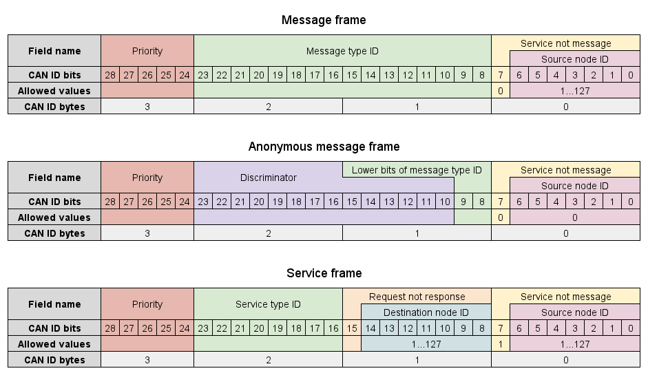

## UAVCAN Specification 4.CAN bus transport layer

## Contents
 - CAN bus transport layer
	 - The concept of transfer
		 - Message broadcasting
		 - Service invocation
	 - Transmission
		 - Transfer ID computation
		 - Payload decomposition
		 - Redundant interface support
	 - CAN frame format
		 - ID field
		 - Payload
	 - Reception
		 - Transfer ID comparison
		 - State variables
		 - State update in a redundant interface configuration
		 - State update in a non-redundant interface configuration
	 - CAN bus requirements
		 - CAN controller driver software

### CAN bus transport layer（CAN 总线传输层）
This chapter defines the CAN bus based transport layer of UAVCAN.
本章定义了基于 CAN 总线的 UAVCAN 传输层。

#### The concept of transfer （传输的概念）
A Transfer is an act of data transmission between nodes. A transfer that is addressed to all nodes except the source node is a broadcast transfer. A transfer that is addressed to one particular node is a unicast transfer. UAVCAN defines the following types of transfers:
传输是指节点之间的数据传输行为。发送到除了源节点之外的所有节点的传输是广播传输。发送到特定节点的传输是单点传输。UAVCAN 定义了以下类型的传输：

- Message transfer - a broadcast transfer that contains a serialized message.
- 消息传输 —— 包含序列化消息的广播传输。
<br/>
- Service transfer - a unicast transfer that contains either a service request or a service response.
- 服务传输 —— 包含服务请求或服务响应的单点传输。

Both message and service transfers can be further distinguished between:
消息和服务的传输可以进一步区分为:

 - Single-frame transfer - a transfer that is entirely contained in a single CAN frame.
 - 单帧传输 —— 一个 CAN 帧中即可以完成的传输。
 <br/>
 - Multi-frame transfer - a transfer that has its payload distributed over multiple CAN frames.
 - 多帧传输 —— 将有效载荷分布在多个 CAN 帧上的传输。

The following properties are common to all types of transfer:
以下属性对所有类型的传输都是通用的：

| Property（属性）| Description（描述） |
| :--- | :--- |
| Payload | The serialized data structure |
| 有效载荷 | 序列化的数据结构 |
| Data type ID | An identifier that indicates how the data structure should be interpreted |
| 数据类型 ID | ID 表示指示如何解析数据结构 |
| Priority | A positive integer value that defines the message urgency (0 is the highest priority). Higher priority transfers can delay transmission of lower priority transfers. |
| 优先级 | 优先级用正整数表示，0 是最高优先级，高优先级的传输会推迟低优先级的传输 |
| Transfer ID | An integer value that allows receiving nodes to distinguish this transfer from all others |
| 传输 ID | 允许接收节点将此传输与所有其他传输区分开的整数值 |

##### Message broadcasting （消息广播）
A broadcast message is carried by a single message transfer that contains the serialized message. A broadcast message has the following properties:
消息广播由包含序列化消息的单个消息传输携带。消息广播具有以下属性：

| Property（属性）| Description（描述） |
| :--- | :--- |
| Payload |	The serialized message |
| 有效载荷 | 序列化的消息 |
| Data type ID |	An identifier that indicates how the message should be interpreted |
| 数据类型 ID | ID 指示如何解析数据结构 |
| Source node ID |	Node ID of the node that has transmitted the transfer |
| 源节点 ID | 发起传输的节点 ID |
| Priority |	See above |
| 优先级 | 优先级用正整数表示，0 是最高优先级，高优先级的传输会推迟低优先级的传输 |
| Transfer ID |	See above |
| 传输 ID | 允许接收节点将此传输与所有其他传输区分开的整数值 |
	
In order to broadcast a message, the broadcasting node must have a node ID that is unique within the network. An exception is applied to anonymous message broadcasts.
为了广播消息，广播节点必须在网络中具有惟一的节点 ID。因此匿名消息广播会产生异常。

###### Anonymous message broadcasting （匿名消息广播）
An anonymous message is a transfer that originates from a node that does not have a node ID. This sort of message transfer is useful for dynamic node ID allocation (a high-level concept that will be explained in the chapter 6 of the specification).
匿名消息是从没有节点 ID 的节点发起的传输。这种消息传输对于动态节点 ID 分配非常有用（这是一个高级概念，将在规范的第 6 章中解释）。

A node that does not have a node ID is said to be in passive mode.
没有节点 ID 的节点称为处于被动模式。

An anonymous message has the same properties as a regular message, except for source node ID.
除了源节点 ID 之外，匿名消息具有与常规消息相同的属性。

An anonymous transfer can only be a single-frame transfer. Multi-frame anonymous messages are not allowed.
匿名传输只能是单帧传输。不允许多帧匿名消息。

Note that anonymous messages require specific arbitration rules and have restrictions on the acceptable data type ID values. The details are explained in the following chapters.
注意，匿名消息需要特定的仲裁规则，并且对可接受的数据类型 ID 值有限制。具体细节将在下面的章节中解释。

###### Timing （时序）
Message transmission should be aborted if it cannot be completed in 1 second.
如果不能在 1 秒内完成，则应中止消息传输。

##### Service invocation (服务调用)
A service invocation consists of two service transfers:
一个服务调用包括两个服务传输：

- Service request transfer - from the node that invokes the service, known as client, to the node that provides the service, known as server.
- 服务请求传输 —— 从调用服务的节点（称为客户端）到提供服务的节点（称为服务端）。
<br/>
- Service response transfer - once the server node receives the service request and processes it, it sends a response transfer back to the client.
- 服务响应传输 —— 一旦服务端节点接收到服务请求并进行处理，它就会将响应传输发送回客户端。

A service request transfer has the following properties:
服务请求传输具有以下属性：

| Property（属性）| Description（描述） |
| :--- | :--- |
| Payload |	The serialized request structure|
| 有效载荷 |	序列化的请求结构 |
| Data type ID | An identifier that indicates how the request should be interpreted |
| 数据类型 ID | ID 指示如何解析数据结构 |
| Source node ID | Node ID of the client |
| 源节点 ID | 客户端的节点 ID |
|Destination node ID|	Node ID of the server|
| 目标节点 ID |	服务端节点 ID |
| Priority | See above |
| 优先级 | 优先级用正整数表示，0 是最高优先级，高优先级的传输会推迟低优先级的传输 |
| Transfer ID |	An integer value that: <br>1. allows the server to distinguish this request from other requests from the same client <br> 2. allows the client to match the response with its request |
| 传输 ID |	一个整数值: <br>1. 服务端用以将此请求与来自同一客户端的其他请求区分开来 <br> 2. 允许客户端将响应与其发出的请求进行匹配 |

A service response transfer has the following properties:
服务响应传输具有以下属性：

| Property（属性）| Description（描述） |
| :--- | :--- |
| Payload |	The serialized response structure |
| 有效载荷 |	序列化的响应结构 |
| Data type ID | Must be the same value as in the request transfer |
| 数据类型 ID | ID 指示如何解析数据结构 |
| Source node ID | Node ID of the server |
| 源节点 ID | 服务端的节点 ID |
| Destination node ID | Node ID of the client |
| 目标节点 ID |	客户端节点 ID |
| Priority | Should be the same value as in the request transfer |
| 优先级 | 应该与请求传输的优先级相同 |
| Transfer ID | Must be the same value as in the request transfer |
| 传输 ID | 必须同请求传输的传输ID为同一个值 |

Both client and server must have node ID values that are unique within the network.
客户端和服务端都必须在网络中具有惟一的节点 ID 值。

###### Timing （时序）
The following timings should be used, unless the application strongly requires different values:
除非应用程序强烈要求不同的值，否则应该使用以下计时：

 - Service transfer transmission should be aborted if does not complete in 1 second.
 - 如果在 1 秒内没有完成，则应中止服务传输。
 <br>
 - The client should stop waiting for a response from the server if one has not arrived within 1 second.
 - 如果服务端在 1 秒内没有响应，客户端应该停止等待。
 <br>
 - The server should be able to process any request in under 0.5 seconds.
 - 服务端应该能够在 0.5 秒内处理任何请求。
 <br>
 - If different values are used, they must be explicitly documented.
 - 如果使用了不同的值，则必须显式地记录它们。

### Transmission （传输过程）
#### Transfer ID computation （传输ID 的计算）

The Transfer ID is a small unsigned integer value that is added to every outgoing transfer (it is used by receiving nodes to distinguish between individual transfers).
传输 ID 是一个小的无符号整数值，它被添加到每个要发出的传输中（接收节点使用它来区分各个传输）。

For message transfers and service request transfers the ID value should be computed as described below. For service response transfers this value must be directly copied from the corresponding service request transfer.
对于消息传输和服务请求传输，ID 值的计算方法如下。对于服务响应传输，此值必须直接从相应的服务请求传输复制。

The logic to compute the Transfer ID relies on the concept of transfer descriptor. A transfer descriptor is a set of properties that identify a particular set of transfers that originate from the same node, share the same data type ID and the same type. The properties that constitute a transfer descriptor are listed below:
计算传输 ID 的逻辑依赖于传输描述符的概念。传输描述符是一组属性，用于标识来自相同节点、共享相同数据类型 ID 和相同类型的特定传输集。构成传输描述符的属性如下：

 - Transfer type (message broadcast, service request, etc.)
 - 传输类型（消息广播、服务请求等）
 <br>
 - Data type ID
 - 数据类型ID
 <br>
 - Source node ID
 - 源节点ID
 <br>
 - Destination node ID (only for unicast transfers)
 - 目标节点ID（仅用于单点传输）


Every node that needs to publish a transfer must maintain the mapping from transfer descriptors to transfer ID. This mapping is referred to as the transfer ID map.
每个需要发布传输的节点都必须维护从传输描述符到传输 ID 的映射。这个映射称为传输 ID 映射。

Whenever a node needs to emit a transfer, it will query its transfer ID map for the appropriate transfer descriptor. If the map does not contain such entry, a new entry will be created with transfer ID initialized to zero. The node will use the current value of transfer ID from the map for the transfer, and then the value stored in the map will be incremented by one. When the stored transfer ID exceeds its maximum value, it will roll over to zero.
任何时候，如果节点需要发出一个传输，它要查询其传输 ID 映射以获得适当的传输描述符。如果映射不包含此类条目，则将创建一个新条目，并将传输 ID 初始化为零。节点将使用来自映射的传输 ID 的当前值进行传输，然后存储在映射中的值将增加 1。当存储的传输 ID 超过其最大值时，它将滚到 0。

It is expected that some nodes will need to publish certain transfers aperiodically or on an ad-hoc basis, thereby creating unused entries in the transfer ID map. In order to avoid keeping unused entries in the map, the nodes are allowed, but not required, to remove entries from the map that were not used for at least 2 seconds. Therefore, it is possible that a node may publish a transfer with an out-of-order transfer ID value, if previous transfer of the same descriptor has been published more than 2 seconds previously.
应用中应该会有一些节点，将需要不定期地或临时地发布某些传输，从而在传输 ID 映射中创建未使用的条目。为了避免在映射中保留未使用的条目，节点可以（但不是必须）从映射中删除至少 2 秒钟未使用的条目。因此，如果相同描述符的先前传输已经在 2 秒之前发布，则节点可能会发布一个新建立的传输 ID 值的传输。

#### Payload decomposition （有效载荷解析）
##### Single frame transfer （单帧传输）
If the size of the entire transfer payload does not exceed the space available for payload in a single CAN frame, the whole transfer will be contained in one CAN frame. Such transfer is called a single-frame transfer.
如果整个传输的有效载荷大小不超过单个 CAN 帧中有效载荷的可用空间，则整个传输将包含在一个 CAN 帧中。这种传输称为单帧传输。

Single frame transfers are more efficient than multi-frame transfers in terms of throughput and latency, therefore it is advised to avoid the latter where possible.
单帧传输在吞吐量和延迟方面比多帧传输更有效，因此建议尽可能避免后者。

##### Multi-frame transfer （多帧传输）
Multi-frame transfers are used when the size of the transfer payload exceeds the space available for payload in a single CAN frame.
当传输负载的大小超过单个 CAN 帧中有效负载的可用空间时，将使用多帧传输。

Two new concepts are introduced in the context of multi-frame transfers, both of which are reviewed below in detail:
在多帧传输的背景下引入了两个新概念，这两个概念的详细介绍如下：

 - Transfer CRC （传输 CRC）
 - Toggle bit （翻转位）

In order to make a multi-frame transfer, the node must first compute a CRC for the transfer payload. The node prepends the CRC value to the transfer payload, and emits this data in chunks as a sequence of CAN frames (i.e. the first CAN frame contains the CRC and the first bytes of the payload). The data field of all CAN frames of a multi-frame transfer, except the last one, must be filled/fully utilized.
为了进行多帧传输，节点必须计算传输负载的 CRC。节点将 CRC 值添加到传输的有效负载中，并以CAN 帧序列（即第一个 CAN帧 包含 CRC 和有效负载的第一个字节）的形式以块的形式发送数据。除了最后一个帧外，所有多帧传输的 CAN 帧的数据域都必须被填充/充分利用。

All frames of a multi-frame transfer should be pushed to the bus at once, in the proper order from the first frame to the last frame.
一个多帧传输的所有帧都应该按从第一帧到最后一帧的顺序全部陆续推送到总线上。

###### Transfer CRC （传输 CRC）
The Transfer CRC is computed from the transfer payload, prepended with a data type signature, in little-endian byte order. The diagram below illustrates the input of the transfer CRC function:
传输 CRC 从传输有效负载计算，以数据类型签名作为前缀，字节顺序为小端。下图说明了传输 CRC 函数的输入：

<div align=center>

The transfer CRC algorithm is specified as follows:
传输 CRC 算法具体如下:

 - Name: CRC-16-CCITT-FALSE
 - Description: http://reveng.sourceforge.net/crc-catalogue/16.htm#crc.cat.crc-16-ccitt-false
 - Initial value: 0xFFFF
 - Poly: 0x1021
 - Reverse: no
 - Output XOR: 0
 - Check: 0x29B1

The following code provides an implementation of the transfer CRC algorithm in C++:
下面的代码提供了一个实现的转移 CRC 算法在 C++的实现：

```
/*
 * License: CC0, no copyright reserved.
 */

#include <iostream>
#include <cstdint>
#include <cassert>

class TransferCRC
{
    std::uint16_t value_;

public:
    TransferCRC()
        : value_(0xFFFFU)
    { }

    void add(std::uint8_t byte)
    {
        value_ ^= static_cast<std::uint16_t>(byte) << 8;
        for (std::uint8_t bit = 8; bit > 0; --bit)
        {
            if (value_ & 0x8000U)
            {
                value_ = (value_ << 1) ^ 0x1021U;
            }
            else
            {
                value_ = (value_ << 1);
            }
        }
    }

    void add(const std::uint8_t* bytes, unsigned len)
    {
        assert(bytes);
        while (len--)
        {
            add(*bytes++);
        }
    }

    std::uint16_t get() const { return value_; }
};

int main()
{
    TransferCRC crc;
    crc.add(reinterpret_cast<const std::uint8_t*>("123456789"), 9);
    std::cout << std::hex << "0x" << crc.get() << std::endl;
}
```

###### Toggle bit (翻转位)
The Toggle bit is a property defined at the CAN frame level. Its purpose is to detect and avoid CAN frame duplication errors.
翻转位是在 CAN 帧级别定义的属性。其目的是检测和避免 CAN 帧重复的错误。

The toggle bit of the first CAN frame of a multi-frame transfer must be set to zero. The toggle bits of the following CAN frames of the transfer must alternate, i.e. the toggle bit of the second CAN frame will be one, the toggle bit of the third CAN frame will be zero, and so on.
多帧传输的第一个 CAN 帧的翻转位必须设置为 0。下面传输的 CAN 帧的翻转位必须是交替的，即第二个 CAN 帧的翻转位为1，第三个CAN帧的翻转位为 0，依此类推。

#### Redundant interface support （冗余接口支持）
In configurations with redundant CAN bus interfaces, nodes are required to transmit every outgoing transfer via all available redundant interfaces simultaneously.
在具有冗余 CAN 总线接口的配置中，节点要发送的传输会通过所有可用的冗余接口同时发出。

An exception to the above rule is applicable if the payload of the transfer depends on some properties of the interface through which the transfer is emitted. An example of such a special case is the time-synchronization algorithm leveraged by UAVCAN (documented in the chapter 6 of the specification).
如果传输的有效载荷取决于接口的某些属性，则可以应用上述规则的例外。这种特殊情况的一个例子是 UAVCAN 用的时间同步算法（在规范的第 6 章中有说明）。

### CAN frame format （CAN 帧格式）
UAVCAN uses only CAN 2.0B frame format (29-bit identifiers). UAVCAN can share the same bus with other protocols based on CAN 2.0A (11-bit identifiers).
UAVCAN 只使用 CAN 2.0B 帧格式（29位标识符）。UAVCAN 可以与基于 CAN 2.0A（11 位标识符）的其他协议共享同一总线。

#### ID field
<div align=center>
<br/>

Contents of the CAN ID field depend on the transfer type.
CAN ID 字段的内容取决于传输类型。

In the case of a message broadcast transfer, the CAN ID field of every frame of the transfer will contain the following fields:
在消息广播传输的情况下，传输的每一帧的 CAN ID 字段将包含以下字段：

| Field（字段） | Bits（位数） | Allowed values（允许的值） | Description（描述） |
| :--- | :--- | :--- | :--- |
| Priority | 5 | Any |	0 is the highest | 
| 优先级 | 5 | 任何数 |	0 是最高优先级 | 
| Message type ID | 16 | Any | Data type ID of the encoded message |
| 消息类型 ID | 16 | 任何数| 编码信息的数据类型 |
| Service not message | 1 | 0 | Always zero |
| 非服务消息 | 1 | 0 | 始终是0 |
| Source node ID | 7 | 1…127 | See below |
| 源节点 ID | 7 | 1…127 | 见下文 |

In the case of an anonymous message transfer, the CAN ID will contain the following fields:
在匿名消息传输的情况下，CAN ID 将包含以下字段：

| Field（字段） | Bits（位数） | Allowed values（允许的值） | Description（描述） |
| :--- | :--- | :--- | :--- |
| Priority | 5 | Any |	0 is the highest | 
| 优先级 | 5 | 任何数 |	0 是最高优先级 | 
| Discriminator	| 14 | Any	|See below |
| 鉴别器 | 14 | 任何数	| 见下文 |
| Lower bits of message type ID | 2 | Any	|Data type ID of the encoded message|
| 消息类型 ID 的低 bit 位|2|任何数| 已编码消息的数据类型 ID |
| Service not message | 1 | 0 | Always zero |
| 非服务消息 | 1 | 0 | 始终是 0 |
| Source node ID | 7 | 0 | Always zero |
| 源节点 ID | 7 | 0| 始终是 0 |

In the case of a service transfer, the CAN ID field of every frame of the transfer will contain the following fields:
在服务传输的情况下，每个传输帧的 CAN ID 字段将包含以下字段：
| Field（字段） | Bits（位数） | Allowed values（允许的值） | Description（描述） |
| :--- | :--- | :--- | :--- |
| Priority | 5 | Any |	0 is the highest | 
| 优先级 | 5 | 任何数 |	0 是最高优先级 | 
| Service type ID | 8 |	Any | Data type ID of the encoded service request or response |
| 服务类型 ID | 8 | 任何数 | 已编码的服务请求或响应的数据类型 ID |
| Request not response | 1 | Any | Values: 1 - service request transfer, 0 - service response transfer |
| 请求或响应 |1| 任何值 | 1 ：服务请求传输 <br> 0 ：服务响应传输|
| Destination node ID |	7 |	1…127 |	See below |
| 目标节点 ID | 7 | 1…127 | 见下文|
| Service not message |	1 |	1 |	Always one |
| 非服务消息 | 1 | 1 | 始终是 1 |
| Source node ID |	7 |	1…127 |	See below |
| 源节点 ID | 7 | 1…127 | 见下文 |

##### Priority （优先级）
Valid values for priority range from 0 to 31, inclusively, where 0 corresponds to highest priority (and 31 corresponds to lowest priority).
优先级的有效值范围从 0 到 31，其中 0 代表最高优先级（31 代表最低优先级）。

In multi-frame transfers, the value of the priority field must be identical for all frames of the transfer.
在多帧传输中，对于传输的所有帧，优先级字段的值必须相同。

##### Message type ID （消息类型 ID）
Valid values of message type ID range from 0 to 65535, inclusively.
消息类型 ID 的有效值范围包括 0 到 65535。

Valid values of message type ID range for anonymous message transfers range from 0 to 3, inclusively. This limitation is due to the fact that only 2 lower bits of the message type ID are available in this case.
匿名消息传输的消息类型 ID 范围的有效值范围包括 0 到 3 。这种限制是由于在这种情况下，消息类型 ID 只有 2 bit 可用。


##### Service type ID （服务类型 ID）
Valid values of service type ID range from 0 to 255, inclusively.
服务类型 ID 的有效值范围包括 0 到 255。

##### Node ID （ 节点 ID）
Valid values of Node ID range from 1 to 127, inclusively.
节点 ID 的有效值范围包括 1 到 127。

Note that Node ID is represented by a 7-bit unsigned integer value and that zero is reserved, to represent either an unknown node or all nodes, depending on the context.
注意，节点 ID 由一个 7 位无符号整数值表示，并保留 0，表示未知节点或所有节点，具体取决于上下文。

##### Discriminator （鉴定器）
CAN bus does not allow different nodes to transmit CAN frames with different data field values under the same CAN ID. Owing to the fact that the CAN ID field includes the node ID value of the transmitting node, this restriction is met by regular UAVCAN transfers. However, anonymous message transfers violate this restriction, because they all share the same node ID of zero.
CAN 总线不允许不同的节点使用相同的 CAN ID 传输具有不同数据字段值的 CAN 帧。由于 CAN ID 字段包含发送节点的节点 ID 值，这一限制可以通过常规的 UAVCAN 传输来满足。但是，匿名消息传输违反了这个限制，因为它们都共享相同的节点ID 0。

In order to work-around this problem, UAVCAN adds a discriminator to the CAN ID field of anonymous message transfers, and defines special logic for handling CAN bus errors during transmission of anonymous frames.
为了解决这个问题，UAVCAN 在匿名消息传输的 CAN ID 字段中添加了一个鉴定器，并定义了处理匿名帧传输过程中 CAN 总线错误的特殊逻辑。

The discriminator field must be filled with random data whenever a node transmits an anonymous message transfer. The source of the random data must be likely to produce different discriminator values for different data field values. A possible way of initializing the discriminator value is to apply the transfer CRC function (as defined above) to the contents of the anonymous message, and then use any 14 bits of the result. Nodes that adopt this approach will be using the same discriminator value for identical messages, which is acceptable since this will not trigger an error on the bus.
每当节点传输匿名消息时，鉴定器字段必须用随机数据填充。随机数据的来源必须能为不同的数据字段值产生不同的鉴定器值。初始化鉴定器值的一种可能的方法是对匿名消息的内容应用传输 CRC 函数（如上定义），然后使用结果的任意14 bit。采用这种方法，不同的匿名节点将对相同的消息使用相同的鉴定值，这是可以接受的，因为这不会在总线上触发错误。

Since the discriminator is only 14 bits long, the probability of having multiple nodes that are emitting CAN frames with the same CAN ID but different data is higher than 0.006% (which is significant). Therefore, the protocol must account for possible errors on the CAN bus triggered by CAN ID collisions. In order to comply with this requirement, UAVCAN requires all nodes to immediately abort transmission of all anonymous transfers once an error on the CAN bus is detected. This measure allows to prevent the bus deadlock that may occur if the automatic retransmission on bus error is not suppressed.
因为鉴定器只有 14 bit 长，所以发出具有相同 CAN ID 但不同数据的 CAN 帧的多个节点的概率高于0.006%（这很重要）。因此，协议必须考虑到由 CAN ID 冲突触发的 CAN 总线上可能出现的错误。为了满足这一要求，UAVCAN 要求所有节点在检测到 CAN 总线上的错误后立即中止所有匿名传输。此措施是为了防止在总线出现错误但自动重传未被抑制时可能发生的总线死锁。

#### Payload （有效载荷）
<div align=center>

<br/>

The Data field of the CAN frame is shared between the following fields:
CAN 帧的数据字段在以下字段之间共享:

| Field （字段）| Description（描述） |
| :--- | :--- |	
| Transfer payload | Actual payload of the transfer |
| 传输有效载荷 | 传输中的实际有效载荷 |
| Tail byte | The last byte of the CAN frame data field, which contains auxiliary transport layer fields |	
| 尾部字节 | CAN帧数据字段的最后一个字节，它包含辅助传输层字段 | 

The tail byte contains the following fields, starting from the most significant bit:
尾字节包含以下字段，从最重要的位开始：

| Field（字段） | Bits（位数） | Description（描述） |
| :--- | :--- | :--- |
| Start of transfer	| 1 |	See below |
| End of transfer | 1 |	See below |
| Toggle bit | 1 |	See below |
| Transfer ID | 5 |	The transfer ID value |

The following figure summarizes the data field format for a single-frame transfer:
下图总结了单帧传输的数据字段格式：
<div align=center>
<br>

The following figure summarizes the data field format for a multi-frame transfer:
下图总结了多帧传输的数据字段格式：

<div align=center>
<br>

##### Start of transfer （开始传输标志）
For single-frame transfers, the value of this field is always 1.
对于单帧传输，这个字段的值总是 1。

For multi-frame transfers, the value of this field is 1 if the current frame is the first frame of the transfer, and 0 otherwise.
对于多帧传输，如果当前帧是传输的第一帧，则此字段的值为 1，否则为 0。

##### End of transfer
For single-frame transfers, the value of this field is always 1.
对于单帧传输，这个字段的值总是 1。

For multi-frame transfers, the value of this field is 1 if the current frame is the last frame of the transfer, and 0 otherwise.
对于多帧传输，如果当前帧是传输的最后一帧，则此字段的值为 1，否则为 0。

##### Toggle bit （翻转位）
For single-frame transfers, the value of this field is always 0.
对于单帧传输，这个字段的值总是 0。

For multi-frame transfers, this field contains the value of the toggle bit. As specified above this will alternate value between frames, starting at 0 for the first frame.
对于多帧传输，此字段包含翻转位的值。如上所述，这将在帧之间交替取值，第一帧从 0 开始。

##### Transfer ID （传输 ID）
This field contains the transfer ID value of the current transfer (for all types of transfers).
此字段包含当前传输的传输 ID 值（用于所有类型的传输）。

The value is 5 bits wide, therefore the allowed values range from 0 to 31, inclusively.
该值位宽为 5 bit，因此允许的值范围包括 0 到 31。


### Reception （响应）

The following explanation relies on the concept of transfer ID forward distance. Transfer ID forward distance is a function of two transfer ID values, A and B, that defines the number of increment operations that need to be applied to A so that A’ equals B. Consider an example:
下面的解释依赖于传输ID前向距离这个概念。传输ID前向距离是两个传输 ID ，A 和 B 的函数，这两个值定义了需要对 A 执行的增量操作的数量，以便 A' 等于B。比如：

 - A = 0, B = 0 ⇒ forward distance 0
 - A = 0, B = 5 ⇒ forward distance 5
 - A = 31, B = 30 ⇒ forward distance 31 (overflow)
 - A = 31, B = 0 ⇒ forward distance 1 (overflow)

The following code sample provides an implementation of the transfer ID comparison algorithm in C++:
下面的代码样本提供了一个传输 ID 的比较算法在 C++ 的实现：
```
/*
 * License: CC0, no copyright reserved.
 */

#include <cstdint>
#include <iostream>
#include <cassert>

constexpr std::uint8_t TransferIDBitLength = 5;

std::int8_t computeForwardDistance(std::uint8_t a, std::uint8_t b)
{
    constexpr std::uint8_t MaxValue = (1U << TransferIDBitLength) - 1U;
    assert((a <= MaxValue) && (b <= MaxValue));

    std::int16_t d = static_cast<std::int16_t>(b) - static_cast<std::int16_t>(a);
    if (d < 0)
    {
        d += 1U << TransferIDBitLength;
    }

    assert((d <= MaxValue) && (d >= -MaxValue));
    assert(((a + d) & MaxValue) == b);
    return static_cast<std::int8_t>(d);
}

int main()
{
    assert(0  == computeForwardDistance(0, 0));
    assert(1  == computeForwardDistance(0, 1));
    assert(7  == computeForwardDistance(0, 7));
    assert(0  == computeForwardDistance(7, 7));
    assert(31 == computeForwardDistance(31, 30)); // overflow
    assert(1  == computeForwardDistance(31, 0));  // overflow
}
```
Half range of transfer ID is 16.
传输 ID 的一半范围是 16。

#### State variables (状态变量)
A node that can receive a transfer must keep a certain set of state variables for each transfer descriptor. The set of state variables will be referred to as receiver state. For the purposes of specification, it is assumed that the node will maintain a mapping from transfer descriptors to receiver states, which is referred to as the receiver map.
可以接收传输的节点必须为每个传输描述符保留一组特定的状态变量。这组状态变量将被称为接收方状态。出于规范的目的，接收节点需要维护从传输描述符到接收方状态的映射，这称为接收方映射。

The receiver state should include at least the following variables:
接收方状态至少应包含以下变量：

| State(状态) | Description （说明）|
| :--- | :--- |
| Transfer payload | Actual payload of the transfer |
| 传输有效载荷 | 实际传输的的有效载荷 |
| Transfer ID | Transfer ID value |
| 传输 ID | 传输 ID 的值|
| Next toggle bit | Expected value of the toggle bit in the next frame of the transfer |
| 下一个翻转位 | 预期的下一个接收到的帧的翻转位 |
| Transfer timestamp |	The local time when the first frame of the transfer arrived |
| 传输时间戳 | 收到第一帧的本地时间 |
| Interface index | Only applicable for a redundant interface configuration |
| 接口索引 | 仅适用于冗余接口配置 |

The following operations are defined for the receiver state:
接收状态定义如下操作：

 - Add data to the payload - this operation adds new data to the current transfer’s payload state.
 - 向有效载荷中添加数据 —— 此操作向当前传输的有效载荷状态添加新数据。
 <br>
 - Reinitialize - this operation resets the state variables to match the parameters of a new transfer.  Reinitialization includes at least the following:
 - 重新启动 —— 此操作重置状态变量，用以匹配一个新传输的参数。重新初始化至少包括以下内容：
 <br>
	 - Clearing the transfer payload;
	 - 清除已经传输的有效载荷；
	 <br>
	 - Updating the transfer ID value with the actual value from the new transfer;
	 - 用新的传输 ID 更新现有的传输 ID 值。
	 <br>
	 - Clearing the toggle bit;
	 - 翻转位清 0；
	 <br>
	 - Initializing the transfer timestamp;
	 - 初始化传输时间戳；
	 <br>
	 - Initializing the interface index, if applicable.
	 - 初始化接口索引，如果有使用的话。

The following conditions are defined for the receiver state:
接收状态被定义了以下几个状态：

 - Uninitialized - this is a default condition, which indicates that the receiver has not yet seen any transfers.
 - 未初始化 —— 这是一个默认条件，表示接收端还没有收到任何传输。
 <br>
 - Transfer ID timeout - last matching transfer was seen more than 2 seconds ago.
 - 传输 ID 超时 —— 距离最后一次匹配传输已经超过 2 秒。
  <br>
 - Interface switch allowed - this condition is only applicable for configurations with redundant CAN bus interfaces. It means that the node is allowed to receive the next transfer from an interface that is not the same as the one the previous transfer was received from. The condition will be reached if the last matching transfer has been successfully received more than Tswitch seconds ago. The value of Tswitch must not exceed 2 seconds. The actual value of Tswitch can be either a constant chosen by the designer according to the application requirements (e.g., maximum recovery time in an event of an interface failure), or the protocol stack may estimate the value automatically by means of analysing the transfer intervals.
 - 允许切换接口 —— 此条件仅适用于具有冗余 CAN 总线接口的配置。这意味着允许该节点从与前一个传输源不同的接口接收下一个传输。如果距离上一次成功接收到匹配传输的时间，超过 Tswitch 秒，就会触发这个条件。Tswitch的值不能超过2秒。Tswitch 的实际值可以由设计人员根据应用需求选择一个常数（例如，在一个接口故障事件中最大的恢复时间），也可以是协议栈通过分析传输间隔自动估计的值。
 
Whenever a node receives a transfer, it will query its receiver map for the matching transfer descriptor. If the matching state does not exist, the node will add a new uninitialized receiver state to the map. The node then will proceed with the procedure of receiver state update, which is defined below.
每当节点接收到一个传输，它都将查询其接收方映射以获得匹配的传输描述符。如果匹配状态不存在，节点将向映射添加一个新的未初始化的接收方状态。然后，节点将继续执行下面定义的接收方状态更新过程。

It is expected that some transfers will be aperiodic or ad-hoc, which implies that the receiver map may accumulate receiver states that are no longer used over time. Therefore, nodes are allowed, but not required, to remove any receiver state from the receiver map, once the state reaches the transfer ID timeout condition.
预计有些传输将是非周期的或临时的，这意味着接收方映射可能会累积不再随时间使用的接收方状态。因此，允许节点（但不是必需的）从接收方映射中删除任何接收方状态，一旦状态达到传输 ID 超时条件。

Receiver state can only be modified when a new CAN frame of a matching transfer is received. This guarantee simplifies implementation, as it implies that the receiver states will not require any background maintenance processes.
 只有在接收到匹配传输的新 CAN 帧时，才能修改接收方状态。这种保证简化了实现，因为它意味着接收方状态不需要任何后台维护过程。

#### State update in a redundant interface configuration (在冗余接口配置中进行状态更新)
The following pseudocode demonstrates the transfer reception process for a configuration with redundant CAN bus interfaces.
下面的伪代码演示了具有冗余 CAN 总线接口的配置的传输接收过程。
```
// Constants:
tid_timeout := 2 seconds;
tid_half_range := 16;
iface_switch_delay := UserDefinedConstant; // Or autodetect

// State variables:
initialized := 0;
payload;
this_transfer_timestamp;
current_transfer_id;
iface_index;
toggle;

function receiveFrame(frame)
{
    // Resolving the state flags:
    tid_timed_out := (frame.timestamp - this_transfer_timestamp) > tid_timeout;
    same_iface := frame.iface_index == iface_index;
    first_frame := frame.start_of_transfer;
    non_wrapped_tid := computeForwardDistance(current_transfer_id, frame.transfer_id) < tid_half_range;
    not_previous_tid := computeForwardDistance(frame.transfer_id, current_transfer_id) > 1;
    iface_switch_allowed := (frame.timestamp - this_transfer_timestamp) > iface_switch_delay;

    // Using the state flags from above, deciding whether we need to reset:
    need_restart :=
        (!initialized) or
        (tid_timed_out) or
        (same_iface and first_frame and not_previous_tid) or
        (iface_switch_allowed and first_frame and non_wrapped_tid);

    if (need_restart)
    {
        initialized := 1;
        iface_index := frame.iface_index;
        current_transfer_id := frame.transfer_id;
        payload.clear();
        toggle := 0;
        if (!first_frame)
        {
            current_transfer_id.increment();
            return;                       // Ignore this frame, since the start of the transfer has already been missed
        }
    }

    if (frame.iface_index != iface_index)
    {
        return;  // Wrong interface, ignore
    }

    if (frame.toggle != toggle)
    {
        return;  // Unexpected toggle bit, ignore
    }

    if (frame.transfer_id != current_transfer_id)
    {
        return;  // Unexpected transfer ID, ignore
    }

    if (first_frame)
    {
        this_transfer_timestamp := frame.timestamp;
    }

    toggle := !toggle;
    payload.append(frame.data);

    if (frame.last_frame)
    {
        // CRC validation for multi-frame transfers is intentionally omitted for brevity
        processTransfer(payload, ...);

        current_transfer_id.increment();
        toggle := 0;
        payload.clear();
    }
}
```

#### State update in a non-redundant interface configuration (在非冗余接口配置中进行状态更新)
The following pseudocode demonstrates the transfer reception process for a configuration with a non-redundant CAN bus interface.
下面的伪代码演示了具有非冗余 CAN 总线接口的配置的传输接收过程。

```
// Constants:
tid_timeout := 2 seconds;

// State variables:
initialized := 0;
payload;
this_transfer_timestamp;
current_transfer_id;
toggle;

function receiveFrame(frame)
{
    // Resolving the state flags:
    tid_timed_out := (frame.timestamp - this_transfer_timestamp) > tid_timeout;
    first_frame := frame.start_of_transfer;
    not_previous_tid := computeForwardDistance(frame.transfer_id, current_transfer_id) > 1;

    // Using the state flags from above, deciding whether we need to reset:
    need_restart :=
        (!initialized) or
        (tid_timed_out) or
        (first_frame and not_previous_tid);

    if (need_restart)
    {
        initialized := 1;
        current_transfer_id := frame.transfer_id;
        payload.clear();
        toggle := 0;
        if (!first_frame)
        {
            current_transfer_id.increment();
            return;                       // Ignore this frame, since the start of the transfer has already been missed
        }
    }

    if (frame.toggle != toggle)
    {
        return;  // Unexpected toggle bit, ignore
    }

    if (frame.transfer_id != current_transfer_id)
    {
        return;  // Unexpected transfer ID, ignore
    }

    if (first_frame)
    {
        this_transfer_timestamp := frame.timestamp;
    }

    toggle := !toggle;
    payload.append(frame.data);

    if (frame.last_frame)
    {
        // CRC validation for multi-frame transfers is intentionally omitted for brevity
        processTransfer(payload, ...);

        current_transfer_id.increment();
        toggle := 0;
        payload.clear();
    }
}
```

### CAN bus requirements (CAN 总线的要求)
The chapter dedicated to hardware design recommendations contains important information concerning CAN bus bit rate, connectors, and other properties of the physical layer of the protocol.
专门介绍硬件设计建议的章节包含了关于 CAN 总线比特率、连接器和协议物理层的其他属性的重要信息。

##### CAN controller driver software (CAN 控制器驱动软件)
Multi-frame transfers use identical CAN ID for all frames of the transfer, and UAVCAN requires that all frames of a multi-frame transfer should be transmitted in order. Therefore, the CAN controller driver software must ensure that CAN frames with identical CAN ID must be transmitted in their order of appearance in the TX queue. Some hardware will not meet this requirement by default, so the designer must take special care to ensure correct behavior, and apply workarounds if necessary.
多帧传输对所有传输帧使用相同的CAN ID，而 UAVCAN 要求多帧传输的所有帧都应该按顺序传输。因此，CAN 控制器驱动软件必须确保具有相同 CAN ID 的 CAN 帧必须按照它们在 TX 队列中的出现顺序传输。有些硬件在默认情况下不能满足这个要求，因此设计人员必须特别注意确保正确的行为和应用场景。

